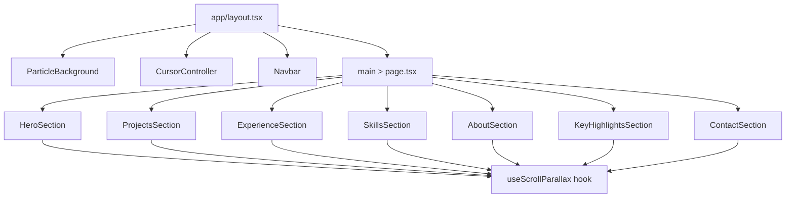

# Design Document: Portfolio Visual Enhancement

## Overview

This feature elevates the existing Next.js portfolio site with premium visual effects layered on top of the current Framer Motion + Tailwind CSS stack. The approach is purely additive — no content, color tokens, responsive breakpoints, or existing component logic is changed. New components are introduced for the custom cursor, particle background, and ambient floating shapes. Existing components are extended with scroll-driven parallax, richer entrance animations, and polished micro-interactions.

The design is constrained to the existing dependency set (`framer-motion`, `next`, `react`, `tailwindcss`) plus one optional lightweight canvas/particle library if needed. All animations respect `prefers-reduced-motion`.

---

## Architecture

The enhancement is structured as three layers stacked in the DOM:

```
┌─────────────────────────────────────────────────────┐
│  Layer 3 — Cursor Overlay (fixed, z-50, pointer-none)│
│  CursorController                                    │
├─────────────────────────────────────────────────────┤
│  Layer 2 — Page Content (existing sections)          │
│  Navbar + Sections + Footer                          │
├─────────────────────────────────────────────────────┤
│  Layer 1 — Background Layer (fixed, z-0, pointer-none│
│  ParticleBackground + AmbientShapes                  │
└─────────────────────────────────────────────────────┘
```

Both Layer 1 and Layer 3 are mounted once in `app/layout.tsx` as client components. All section-level enhancements (parallax blobs, stagger reveals, micro-interactions) live inside the existing section components.



---

## Components and Interfaces

### New Components

#### `CursorController` (`components/ui/CursorController.tsx`)

Client-only component mounted in `layout.tsx`. Uses `useEffect` to listen to `mousemove` events and lerp the orb position each `requestAnimationFrame`. Detects `(pointer: fine)` via `window.matchMedia` before rendering. Respects `useReducedMotion`.

```ts
// No props — self-contained singleton
export default function CursorController(): JSX.Element | null
```

Internal state:
- `mousePos: { x: number; y: number }` — raw mouse position
- `orbPos: { x: number; y: number }` — lerped display position
- `isHovering: boolean` — expanded state when over interactive elements
- `isVisible: boolean` — false on touch/non-pointer devices

Lerp factor: `0.10` (within the 0.08–0.15 range specified).

#### `ParticleBackground` (`components/ui/ParticleBackground.tsx`)

Client-only component mounted in `layout.tsx`. Renders 40 particles (within the 30–60 range) as `motion.div` elements positioned `fixed`. Each particle has an independently seeded float animation. Respects `useReducedMotion` — static dots when reduced motion is active.

```ts
interface Particle {
  id: number
  x: number        // vw percentage
  y: number        // vh percentage
  size: number     // 1–3px
  opacity: number  // 0.05–0.25
  duration: number // 4–12s
  driftX: number   // ±10px
  driftY: number   // ±20px
  delay: number    // stagger offset
}

// No props — self-contained
export default function ParticleBackground(): JSX.Element
```

Particle positions are computed once on mount using a seeded pseudo-random function (based on index) to ensure SSR-safe determinism. `will-change: transform` is applied to each animated particle.

#### `AmbientShapes` (`components/ui/AmbientShapes.tsx`)

Renders 5 abstract floating shapes (circles and rounded rectangles) distributed across the page. Positioned `fixed` with `z-index: 0`. Opacity 0.03–0.08. Respects `useReducedMotion`.

```ts
interface AmbientShape {
  id: number
  type: 'circle' | 'rounded-rect'
  x: number        // vw %
  y: number        // vh %
  width: number    // px
  height: number   // px
  floatRange: number  // 8–18px
  duration: number    // 5–10s
  delay: number
}

export default function AmbientShapes(): JSX.Element
```

### Modified Components

#### `AnimatedSection` (`components/ui/AnimatedSection.tsx`)

Already implements `useReducedMotion` and `useInView` with `once: true` and `margin: '-60px'`. The existing `fadeSlideUp` variant already matches Requirement 6 (opacity 0→1, y 32→0, blur 4→0, 0.7s, `[0.22, 1, 0.36, 1]`). No structural changes needed — the component already satisfies Requirements 6.1–6.5.

#### `HeroSection` (`components/sections/HeroSection.tsx`)

Already implements staggered entrance with `staggerChildren: 0.07`, blur+translate+opacity transitions, and `useTransform` scroll fade. Verify total duration ≤ 1.8s and stagger increment is within 0.07–0.12s. Minor tuning may be needed to ensure the badge is included in the stagger sequence.

#### `ProjectCard` (`components/ui/ProjectCard.tsx`)

Already has `whileHover={{ y: -6 }}` with spring (stiffness 300, damping 22) and shimmer sweep. Satisfies Requirements 7.1 and 7.5. No changes needed.

#### `SkillBadge` (`components/ui/SkillBadge.tsx`)

Already has `whileHover={{ scale: 1.08, y: -2 }}`. Satisfies Requirement 7.2. No changes needed.

#### Section blob `motion.div` elements

Each section already has ambient blob `motion.div` elements. They need to be audited to ensure:
- Blur is `blur-[80px]` or greater (Req 3.1) ✓ (existing blobs use `blur-[100px]`–`blur-[160px]`)
- Scale cycles between 1.0 and 1.1 with 8–14s period (Req 3.3) ✓ (existing: `scale: [1, 1.1, 1]`, 9–14s)
- Colors use only `electric-blue` / `cyan-accent` tokens (Req 3.4) ✓

Parallax via `useScroll`/`useTransform` needs to be added to blob wrappers in each section (Req 4).

### Custom Hook

#### `useScrollParallax` (`hooks/useScrollParallax.ts`)

```ts
interface UseScrollParallaxOptions {
  range?: [number, number]   // output range in %, default [-8, 8]
  offset?: [string, string]  // useScroll offset, default ['start end', 'end start']
}

export function useScrollParallax(
  ref: React.RefObject<HTMLElement>,
  options?: UseScrollParallaxOptions
): MotionValue<string>
```

Returns a `MotionValue<string>` (e.g. `"-8%"` to `"8%"`) derived from `useScroll` + `useTransform`. When `useReducedMotion()` returns true, returns a static `MotionValue` of `"0%"`.

---

## Data Models

### Particle Model

```ts
interface Particle {
  id: number
  x: number        // 0–100 (vw %)
  y: number        // 0–100 (vh %)
  size: number     // 1–3 (px)
  opacity: number  // 0.05–0.25
  duration: number // 4–12 (seconds)
  driftX: number   // -10 to +10 (px)
  driftY: number   // -20 to +20 (px)
  delay: number    // 0–4 (seconds, stagger)
}
```

### AmbientShape Model

```ts
interface AmbientShape {
  id: number
  type: 'circle' | 'rounded-rect'
  x: number        // 0–100 (vw %)
  y: number        // 0–100 (vh %)
  width: number    // 40–120 (px)
  height: number   // 40–120 (px)
  floatRange: number  // 8–18 (px)
  duration: number    // 5–10 (seconds)
  delay: number       // 0–3 (seconds)
  opacity: number     // 0.03–0.08
}
```

### CursorState Model

```ts
interface CursorState {
  mousePos: { x: number; y: number }
  orbPos: { x: number; y: number }
  isHovering: boolean   // over interactive element
  isVisible: boolean    // pointer:fine device
}
```

---

## Correctness Properties

*A property is a characteristic or behavior that should hold true across all valid executions of a system — essentially, a formal statement about what the system should do. Properties serve as the bridge between human-readable specifications and machine-verifiable correctness guarantees.*

### Property 1: Cursor orb never intercepts pointer events

*For any* rendered state of the CursorController, the orb element's `pointerEvents` style must always be `"none"`, regardless of hover state, orb size, or position.

**Validates: Requirements 1.6**

---

### Property 2: Reduced motion disables cursor orb

*For any* CursorController rendered with `prefers-reduced-motion: reduce` active, the component must return null (orb is not present in the DOM).

**Validates: Requirements 1.5**

---

### Property 3: Particle count is within bounds

*For any* rendered ParticleBackground, the number of particle elements in the DOM must be between 30 and 60 inclusive.

**Validates: Requirements 2.1**

---

### Property 4: Particle opacity is within ambient range

*For any* particle in the ParticleBackground, its configured opacity value must be between 0.05 and 0.25 inclusive.

**Validates: Requirements 2.3**

---

### Property 5: Reduced motion renders particles as static

*For any* ParticleBackground rendered with `prefers-reduced-motion: reduce` active, no particle element should have an active Framer Motion animation (all particles are static).

**Validates: Requirements 2.5**

---

### Property 6: Ambient shapes never intercept pointer events

*For any* rendered AmbientShapes component, every shape element must have `pointerEvents: "none"` applied.

**Validates: Requirements 9.4**

---

### Property 7: Ambient shape opacity is within ambient range

*For any* ambient shape in the AmbientShapes component, its configured opacity must be between 0.03 and 0.08 inclusive.

**Validates: Requirements 9.3**

---

### Property 8: Scroll parallax returns zero offset in reduced motion

*For any* call to `useScrollParallax` when `useReducedMotion()` returns true, the returned MotionValue must always resolve to `"0%"` regardless of scroll position.

**Validates: Requirements 4.4**

---

### Property 9: AnimatedSection reveals only once

*For any* AnimatedSection component, once it has transitioned to the `"visible"` state (entered the viewport), it must not revert to `"hidden"` on subsequent scroll events.

**Validates: Requirements 6.4**

---

### Property 10: Section dividers are present at every section boundary

*For any* section component rendered on the page, a horizontal gradient divider element (`h-px` with gradient classes) must be present at the top edge of the section's outer wrapper.

**Validates: Requirements 8.2**

---

## Error Handling

### SSR / Hydration Safety

- `CursorController` and `ParticleBackground` must be wrapped in a `useEffect` mount guard (`isMounted` state) before accessing `window` or `document`. This prevents SSR hydration mismatches (Req 10.4).
- Particle positions are computed with a deterministic seeded function (index-based) so server and client produce the same initial render.

### `(pointer: fine)` Detection

- `CursorController` checks `window.matchMedia('(pointer: fine)').matches` inside `useEffect`. If false (touch device), the component returns null immediately and does not attach event listeners.

### Resize Handling

- `ParticleBackground` listens to `window.resize` (debounced 100ms) and recomputes particle positions clamped to the new viewport dimensions (Req 2.4).

### TypeScript

- All new components and hooks must be fully typed with no `any` casts.
- The `next build` must produce zero TypeScript errors (Req 10.6).

### Animation Budget

- `ParticleBackground` caps at 40 particles by default. Combined with existing section blobs (~2 per section × 7 sections = 14) and ambient shapes (5), the total animated DOM elements stays well under the 80-element cap (Req 10.2).

---

## Testing Strategy

### Dual Testing Approach

Both unit tests and property-based tests are used. Unit tests cover specific examples, integration points, and edge cases. Property tests verify universal invariants across randomized inputs.

### Unit Tests

- `CursorController`: renders null on touch devices, renders null in reduced motion, orb expands on hover class detection.
- `ParticleBackground`: renders correct number of particles, static in reduced motion.
- `AmbientShapes`: renders correct number of shapes, all have `pointer-events: none`.
- `useScrollParallax`: returns `"0%"` when reduced motion is active.
- `AnimatedSection`: existing tests cover reveal behavior; verify `once: true` is preserved.

### Property-Based Tests (fast-check)

The project already uses `fast-check` (v3.20.0) as a dev dependency. Each property test runs a minimum of 100 iterations.

Tag format: `Feature: portfolio-visual-enhancement, Property {N}: {property_text}`

**Property 1 — Cursor orb never intercepts pointer events**
Generate arbitrary cursor states (random positions, hover states). Assert `pointerEvents === "none"` on the orb element in all cases.
`// Feature: portfolio-visual-enhancement, Property 1: cursor orb never intercepts pointer events`

**Property 2 — Reduced motion disables cursor orb**
Render CursorController with mocked `useReducedMotion = true`. Assert component returns null.
`// Feature: portfolio-visual-enhancement, Property 2: reduced motion disables cursor orb`

**Property 3 — Particle count is within bounds**
Generate arbitrary viewport sizes. Assert particle count is always in [30, 60].
`// Feature: portfolio-visual-enhancement, Property 3: particle count is within bounds`

**Property 4 — Particle opacity is within ambient range**
Generate arbitrary particle arrays. Assert every opacity is in [0.05, 0.25].
`// Feature: portfolio-visual-enhancement, Property 4: particle opacity is within ambient range`

**Property 5 — Reduced motion renders particles as static**
Render ParticleBackground with mocked `useReducedMotion = true`. Assert no particle has `animate` prop with motion values.
`// Feature: portfolio-visual-enhancement, Property 5: reduced motion renders particles as static`

**Property 6 — Ambient shapes never intercept pointer events**
Generate arbitrary shape configurations. Assert all shapes have `pointerEvents: "none"`.
`// Feature: portfolio-visual-enhancement, Property 6: ambient shapes never intercept pointer events`

**Property 7 — Ambient shape opacity is within ambient range**
Generate arbitrary shape arrays. Assert every opacity is in [0.03, 0.08].
`// Feature: portfolio-visual-enhancement, Property 7: ambient shape opacity is within ambient range`

**Property 8 — Scroll parallax returns zero offset in reduced motion**
Generate arbitrary scroll progress values (0–1). With `useReducedMotion = true`, assert `useScrollParallax` always returns `"0%"`.
`// Feature: portfolio-visual-enhancement, Property 8: scroll parallax returns zero offset in reduced motion`

**Property 9 — AnimatedSection reveals only once**
Simulate viewport entry and exit events. Assert that once `visible`, the animation state never returns to `hidden`.
`// Feature: portfolio-visual-enhancement, Property 9: AnimatedSection reveals only once`

**Property 10 — Section dividers are present at every section boundary**
Render each section component. Assert a `h-px` gradient divider element exists at the top of each section's outer wrapper.
`// Feature: portfolio-visual-enhancement, Property 10: section dividers are present at every section boundary`
