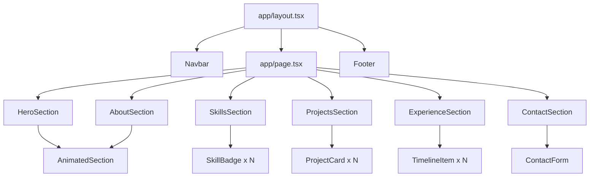

# Design Document: rahmat-portfolio-website

## Overview

A single-page portfolio website for Rahmat Sigit Hidayat, a Data Analyst and Data Science graduate. The site is built with Next.js (App Router), React, TypeScript, Tailwind CSS, and Framer Motion. It presents a dark, minimal, data-focused aesthetic with Electric Blue (`#0066FF`) accents on an Orbit Navy (`#0A1024`) background.

The site is a static, content-driven application. All content lives in a single data file (`/data/portfolioData.ts`). Sections are rendered as React Server Components where possible, with Client Components used only where interactivity or animation is required (Navbar active-link detection, contact form, Framer Motion animations).

### Goals

- Fast, accessible, SEO-optimized portfolio page
- Zero-CMS: all content editable from one TypeScript file
- Smooth scroll animations with full reduced-motion support
- Fully responsive from 375px to 1440px+

---

## Architecture

### Technology Stack

| Layer | Technology |
|---|---|
| Framework | Next.js 14+ (App Router) |
| Language | TypeScript (strict mode) |
| Styling | Tailwind CSS v3 |
| Animation | Framer Motion v11 |
| Font | Geist (via `next/font/google`) |
| Deployment | Vercel (static export compatible) |

### Rendering Strategy

The root `app/page.tsx` is a React Server Component that composes all section components. Sections that require viewport detection or user interaction are wrapped in `"use client"` Client Components. The split is:

- **Server Components**: `HeroSection`, `AboutSection`, `SkillsSection`, `ProjectsSection`, `ExperienceSection`, `Footer` (static markup, no interactivity)
- **Client Components**: `Navbar` (scroll + IntersectionObserver), `ContactSection` (form state), `AnimatedSection` (Framer Motion wrapper), `ProjectCard` (hover), `SkillBadge` (hover), `TimelineItem` (staggered animation)

### Folder Structure

```
/
├── app/
│   ├── layout.tsx          # Root layout: font, metadata, Navbar, Footer
│   ├── page.tsx            # Composes all sections
│   └── globals.css         # Tailwind base + custom CSS variables
├── components/
│   ├── layout/
│   │   ├── Navbar.tsx
│   │   └── Footer.tsx
│   ├── sections/
│   │   ├── HeroSection.tsx
│   │   ├── AboutSection.tsx
│   │   ├── SkillsSection.tsx
│   │   ├── ProjectsSection.tsx
│   │   ├── ExperienceSection.tsx
│   │   └── ContactSection.tsx
│   └── ui/
│       ├── ProjectCard.tsx
│       ├── TimelineItem.tsx
│       ├── SkillBadge.tsx
│       ├── SectionWrapper.tsx
│       └── AnimatedSection.tsx
├── data/
│   └── portfolioData.ts
└── types/
    └── index.ts
```

### Page Composition



---

## Components and Interfaces

### Navbar

**Type**: Client Component (`"use client"`)

**Responsibilities**:
- Renders a fixed top navigation bar with links: About, Skills, Projects, Experience, Contact
- Detects which section is currently in the viewport using `IntersectionObserver`
- Highlights the active link with Electric Blue (`#0066FF`)
- Applies a backdrop blur + semi-transparent background on scroll

**Active Link Detection**:
Each section element carries an `id` matching its nav link. A single `IntersectionObserver` with `threshold: 0.5` watches all section elements. The link whose section has the highest intersection ratio is marked active. On mount, the observer is set up; on unmount, it is disconnected.

```tsx
// Pseudocode
const observer = new IntersectionObserver(
  (entries) => {
    entries.forEach(entry => {
      if (entry.isIntersecting) setActiveSection(entry.target.id)
    })
  },
  { threshold: 0.5 }
)
sectionIds.forEach(id => observer.observe(document.getElementById(id)))
```

**Props**: none (reads section IDs from a static config array)

---

### SectionWrapper

**Type**: Server Component

A layout wrapper that applies consistent vertical padding, `max-w-6xl`, horizontal centering, and an `id` attribute for scroll targeting.

```tsx
interface SectionWrapperProps {
  id: string
  children: React.ReactNode
  className?: string
}
```

---

### AnimatedSection

**Type**: Client Component (`"use client"`)

Wraps any content in a Framer Motion `motion.div` that fades in and slides up when it enters the viewport.

```tsx
interface AnimatedSectionProps {
  children: React.ReactNode
  delay?: number       // stagger offset in seconds, default 0
  className?: string
}
```

**Animation variant**:
```ts
const variants = {
  hidden: { opacity: 0, y: 20 },
  visible: { opacity: 1, y: 0, transition: { duration: 0.5, ease: 'easeOut' } }
}
```

Uses `useInView` from Framer Motion with `once: true` so the animation fires once on first viewport entry. Uses `useReducedMotion()` to skip animation when the OS preference is set.

---

### HeroSection

**Type**: Server Component (static markup) + `AnimatedSection` wrapper

Renders: name heading, title, tagline, "View Projects" CTA button (anchor `href="#projects"`).

---

### AboutSection

**Type**: Server Component + `AnimatedSection` wrapper

Renders: section heading, professional summary paragraph from `portfolioData.personalInfo.about`.

---

### SkillsSection

**Type**: Server Component + `AnimatedSection` wrapper

Renders: section heading, then for each `SkillCategory` in `portfolioData.skills`, a category label followed by a flex-wrap row of `SkillBadge` components.

---

### SkillBadge

**Type**: Client Component (`"use client"`)

```tsx
interface SkillBadgeProps {
  label: string
}
```

Renders a pill-shaped badge. On hover, applies Electric Blue border glow via Tailwind `hover:shadow-[0_0_8px_#0066FF]` and a slight scale transform.

---

### ProjectsSection

**Type**: Server Component + `AnimatedSection` wrapper

Renders: section heading, responsive grid of `ProjectCard` components sourced from `portfolioData.projects`.

**Grid breakpoints**:
- Mobile (default): `grid-cols-1`
- Tablet (≥768px): `md:grid-cols-2`
- Desktop (≥1280px): `xl:grid-cols-3`

---

### ProjectCard

**Type**: Client Component (`"use client"`)

```tsx
interface ProjectCardProps {
  project: Project
}
```

Renders: optional image, title, description, tech tag list, and link buttons (GitHub / Live Demo / Publication). On hover, applies a lift effect (`hover:-translate-y-1`) and Electric Blue border glow.

---

### ExperienceSection

**Type**: Server Component + staggered `AnimatedSection` wrappers per item

Renders: section heading, then two sub-sections ("Work Experience" and "Education"), each containing a vertical list of `TimelineItem` components. Each item is wrapped in `AnimatedSection` with an incrementing `delay` prop to produce a stagger effect.

---

### TimelineItem

**Type**: Client Component (`"use client"`)

```tsx
interface TimelineItemProps {
  item: Experience | Education
  index: number
}
```

Renders: a vertical timeline connector line, a dot marker, role/degree, organization, date range, location, and description. The connector line uses a left border in Electric Blue.

---

### ContactSection

**Type**: Client Component (`"use client"`)

Renders: contact details (email, phone, social links) and an optional contact form with fields: name, email, message.

**Validation logic** (client-side only):
- On submit, validate each required field is non-empty and non-whitespace
- Email field validated against a basic regex: `/^[^\s@]+@[^\s@]+\.[^\s@]+$/`
- Inline error messages rendered below each invalid field
- Form does not submit (no network call) if any field is invalid

---

### Footer

**Type**: Server Component

Renders: copyright line with current year, name, and a "Back to top" link.

---

## Data Models

All interfaces are defined in `/types/index.ts` and imported by `portfolioData.ts` and all components.

```ts
// /types/index.ts

export interface PersonalInfo {
  name: string
  title: string
  tagline: string
  about: string
  email: string
  phone: string
  location: string
  linkedin: string
  github: string
  tableau: string
}

export interface SkillCategory {
  category: string          // e.g. "Technical Skills"
  skills: string[]
}

export interface Project {
  id: string
  title: string
  description: string
  techTags: string[]
  imageUrl?: string         // optional thumbnail
  githubUrl?: string
  liveUrl?: string
  publicationUrl?: string
}

export interface Experience {
  type: 'work'
  role: string
  organization: string
  location: string
  startDate: string         // "MMM YYYY" format
  endDate: string           // "MMM YYYY" or "Present"
  description: string[]     // bullet points
}

export interface Education {
  type: 'education'
  degree: string
  institution: string
  location: string
  startDate: string
  endDate: string
  gpa?: string
  honors?: string
  description?: string[]
}

export type TimelineEntry = Experience | Education
```

**`/data/portfolioData.ts` shape**:

```ts
import type { PersonalInfo, SkillCategory, Project, Experience, Education } from '@/types'

export const personalInfo: PersonalInfo = { ... }
export const skills: SkillCategory[] = [ ... ]
export const projects: Project[] = [ ... ]
export const workExperience: Experience[] = [ ... ]
export const education: Education[] = [ ... ]
```

### Design Token Reference (Tailwind config)

```ts
// tailwind.config.ts — extend.colors
colors: {
  'orbit-navy':    '#0A1024',
  'electric-blue': '#0066FF',
  'surface':       '#111827',   // card backgrounds
  'text-primary':  '#F9FAFB',
  'text-muted':    '#9CA3AF',
}
```

### Framer Motion Animation Patterns

**Fade + slide variant** (used by `AnimatedSection`):
```ts
const fadeSlide = {
  hidden:  { opacity: 0, y: 20 },
  visible: { opacity: 1, y: 0, transition: { duration: 0.5, ease: 'easeOut' } }
}
```

**Stagger container** (used by `ExperienceSection` for timeline items):
```ts
const staggerContainer = {
  hidden:  {},
  visible: { transition: { staggerChildren: 0.12 } }
}
```

**Reduced motion**: `AnimatedSection` calls `const shouldReduce = useReducedMotion()` and passes `animate={shouldReduce ? 'visible' : undefined}` so items render in their final state immediately when reduced motion is preferred.

---

## Correctness Properties

*A property is a characteristic or behavior that should hold true across all valid executions of a system — essentially, a formal statement about what the system should do. Properties serve as the bridge between human-readable specifications and machine-verifiable correctness guarantees.*


### Property 1: Reduced Motion Compliance

*For any* instance of `AnimatedSection` where `useReducedMotion()` returns `true`, the component SHALL render its children in the final visible state (opacity: 1, y: 0) immediately, without transitioning from the hidden state.

**Validates: Requirements 2.5**

---

### Property 2: Skills Data Round-Trip

*For any* `SkillCategory` array passed as `portfolioData.skills`, every category name and every skill string within each category SHALL appear in the rendered output of `SkillsSection`.

**Validates: Requirements 5.1, 5.2, 11.3**

---

### Property 3: Projects Data Round-Trip

*For any* `Project` object in `portfolioData.projects`, the rendered `ProjectCard` for that project SHALL contain the project's title, description, all entries in `techTags`, and all non-null link URLs (`githubUrl`, `liveUrl`, `publicationUrl`).

**Validates: Requirements 6.1, 6.2, 11.3**

---

### Property 4: Timeline Data Round-Trip

*For any* `TimelineEntry` (either `Experience` or `Education`) in `portfolioData.workExperience` or `portfolioData.education`, the rendered `TimelineItem` for that entry SHALL contain the role/degree, organization name, date range, and location.

**Validates: Requirements 7.1, 7.2, 11.3**

---

### Property 5: Timeline Stagger Ordering

*For any* ordered list of `TimelineItem` components rendered by `ExperienceSection`, each item at index `i` SHALL receive a `delay` prop equal to `i * staggerInterval`, ensuring items animate in sequentially from top to bottom.

**Validates: Requirements 7.5**

---

### Property 6: Contact Form Validation

*For any* contact form submission where at least one required field (name, email, or message) is empty or composed entirely of whitespace, the form SHALL display an inline validation error for each invalid field and SHALL NOT proceed to submit.

**Validates: Requirements 8.5**

---

### Property 7: Active Navigation Link

*For any* section ID that is currently intersecting the viewport (as reported by `IntersectionObserver`), the `Navbar` SHALL mark exactly that section's navigation link as active and SHALL NOT mark any other link as active simultaneously.

**Validates: Requirements 9.4**

---

## Error Handling

### Data Layer

- `portfolioData.ts` is a static TypeScript module. TypeScript strict mode and interface enforcement prevent malformed data at compile time.
- Optional fields (`imageUrl`, `githubUrl`, `liveUrl`, `publicationUrl`, `gpa`, `honors`) are typed as `string | undefined`. Components must guard against `undefined` before rendering (e.g., `{project.imageUrl && <Image ... />}`).

### Contact Form

- Client-side validation runs on submit, not on blur, to avoid premature error messages.
- Validation errors are stored in a `Record<string, string>` state object keyed by field name.
- Each field renders its error message below the input only when the corresponding key is present in the errors object.
- Email format validation uses `/^[^\s@]+@[^\s@]+\.[^\s@]+$/` — intentionally simple, as the form has no server-side submission in the initial implementation.

### Animation

- `AnimatedSection` wraps `useInView` in a try/catch-free pattern; Framer Motion handles SSR gracefully by defaulting to the `visible` state during server render.
- `useReducedMotion()` is called unconditionally at the top of `AnimatedSection` to comply with React's rules of hooks.

### Image Loading

- `next/image` is used for all project thumbnails. The `alt` attribute is required and sourced from `project.title`.
- Images that fail to load fall back to a placeholder background color (`surface` token) via CSS.

### Navigation

- If `IntersectionObserver` is not available (very old browsers), the Navbar renders without active-link highlighting — no crash.
- Smooth scroll uses `scroll-behavior: smooth` in CSS rather than JavaScript, ensuring it degrades gracefully.

---

## Testing Strategy

### Dual Testing Approach

Both unit tests and property-based tests are required. They are complementary:

- **Unit tests** verify specific examples, integration points, and edge cases.
- **Property-based tests** verify universal properties across many generated inputs.

### Property-Based Testing

**Library**: [fast-check](https://github.com/dubzzz/fast-check) (TypeScript-native, works with Vitest/Jest)

**Configuration**: Each property test runs a minimum of **100 iterations** (`numRuns: 100`).

Each property test is tagged with a comment in the format:
```
// Feature: rahmat-portfolio-website, Property N: <property_text>
```

| Property | Test Description | fast-check Arbitraries |
|---|---|---|
| P1: Reduced motion | Mock `useReducedMotion` to return `true`; render `AnimatedSection`; assert final state | `fc.anything()` for children |
| P2: Skills round-trip | Generate random `SkillCategory[]`; render `SkillsSection`; assert all categories and skills present | `fc.array(fc.record({ category: fc.string(), skills: fc.array(fc.string()) }))` |
| P3: Projects round-trip | Generate random `Project[]`; render `ProjectsSection`; assert each card contains all fields | `fc.array(fc.record({ id: fc.uuid(), title: fc.string(), description: fc.string(), techTags: fc.array(fc.string()), ... }))` |
| P4: Timeline round-trip | Generate random `TimelineEntry[]`; render `ExperienceSection`; assert each item contains required fields | `fc.array(fc.oneof(experienceArb, educationArb))` |
| P5: Timeline stagger | Generate a list of N timeline items; assert item at index i has delay = i * staggerInterval | `fc.array(timelineEntryArb, { minLength: 1, maxLength: 20 })` |
| P6: Form validation | Generate combinations of empty/non-empty field values where at least one is empty; submit form; assert errors shown and no submit | `fc.record({ name: fc.oneof(fc.constant(''), fc.string()), email: ..., message: ... })` filtered to have ≥1 empty |
| P7: Active nav link | Generate a section ID from the known set; simulate intersection; assert only that link is active | `fc.constantFrom('about', 'skills', 'projects', 'experience', 'contact')` |

### Unit Tests

Unit tests use **Vitest** + **React Testing Library**.

Focus areas:
- `HeroSection`: renders name "Rahmat Sigit Hidayat", title "Data Analyst", CTA link `href="#projects"`
- `ContactSection`: renders all three social link URLs from `personalInfo`; form renders name, email, message fields
- `Navbar`: renders links for all 5 sections; correct `href` attributes
- `portfolioData`: contains required projects (by title), required work entries (by role), required education entries (by degree)
- `ProjectCard`: renders image when `imageUrl` is defined; does not render `` when `imageUrl` is undefined (edge case)
- `metadata` export: contains non-empty `title`, `description`, `openGraph.title`, `openGraph.description`, `openGraph.type`
- Grid container in `ProjectsSection`: has classes `grid-cols-1 md:grid-cols-2 xl:grid-cols-3`

### Test File Locations

```
/__tests__/
  unit/
    HeroSection.test.tsx
    ContactSection.test.tsx
    Navbar.test.tsx
    ProjectCard.test.tsx
    portfolioData.test.ts
    metadata.test.ts
  property/
    AnimatedSection.prop.test.tsx   # P1
    SkillsSection.prop.test.tsx     # P2
    ProjectsSection.prop.test.tsx   # P3
    ExperienceSection.prop.test.tsx # P4, P5
    ContactForm.prop.test.tsx       # P6
    Navbar.prop.test.tsx            # P7
```
